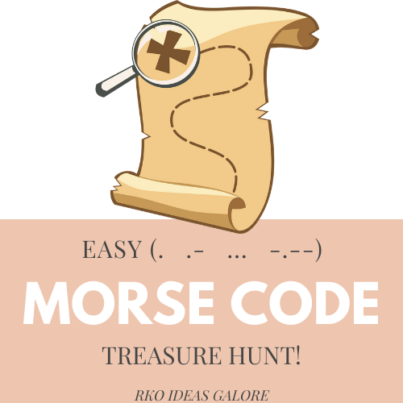

# Dedode_Morse-Code

The Program written in ruby will let you decode the pirate treasure's Message 😉





## Getting Started

## Run Locally

Clone the project

```bash
  git clone https://github.com/developerwaleed/Dedode_Morse-Code.git
```

Go to the project directory

```bash
  cd Dedode_Morse-Code
```

Install dependencies

[ruby](https://www.ruby-lang.org/en/documentation/installation/)

Run Script

```bash
  ruby morse_code.rb
```
## Authors

| 👤 Name | Github | Twitter | LinkedIn |
|------|--------|---------|----------|
|Waleed Amjad|[@caasperr](https://github.com/developerwaleed)|[@developerwaleed](https://twitter.com/developerwaleed)|[@developerwaleed](https://www.linkedin.com/in/developerwaleed/)|
|Shahnawaz Ali|[@shahnawaza75](https://github.com/shahnawaza75)|

## 🤝 Contributing

Contributions, issues, and feature requests are welcome!

Feel free to check the [issues page](../../issues/).

## Show your support

Give a ⭐️ if you like this project!
